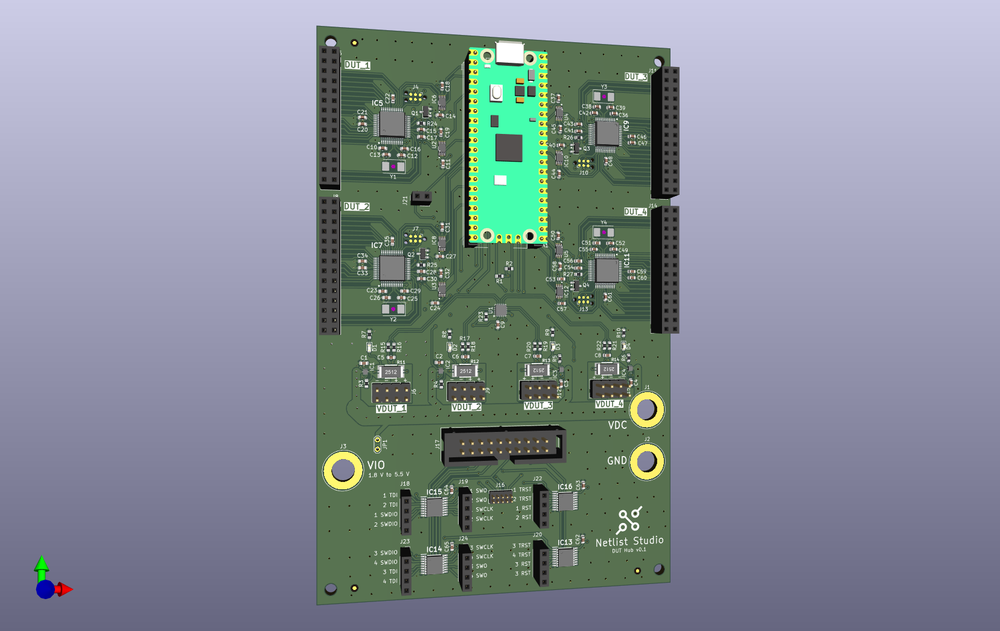

# DUT Hub

A KiCad hardware project for a multi-channel DUT (Device Under Test) hub with integrated JTAG multiplexing, power management, and Raspberry Pi Pico control interface.



## Features

- **4-channel DUT interface** with individual power control via TPS22992
- **JTAG multiplexer** for debug access to multiple targets
- **Power monitoring** using PAC1954 for per-channel current/voltage measurement
- **Raspberry Pi Pico** for control logic and automation
- **USB interface** through Pi Pico USB-CDC for host communication (1 port for each DUT)


## Project Structure

```
├── *.kicad_sch          # Schematic sheets (hierarchical design)
├── dut_hub.kicad_pcb    # PCB layout
├── dut_hub.kicad_pro    # KiCad project file
├── dut_hub.kicad_sym    # Local symbol library
├── dut_hub.pretty/      # Local footprint library
├── 3d_models/           # 3D component models
├── assembly/            # Pick and place files for manufacturing
├── gerber_to_order/     # Gerber files ready for fabrication
├── docs/                # Documentation (schematic PDF)
└── images/              # Project images
```

## Schematic Hierarchy

- `dut_hub.kicad_sch` - Top-level schematic
- `power.kicad_sch` - Power supply and distribution
- `jtag_mux.kicad_sch` - JTAG multiplexer
- `raspberry_pico.kicad_sch` - Pico microcontroller interface
- `dut.kicad_sch` - DUT channel template
- `dut1-4.kicad_sch` - Individual DUT channel instances

## Manufacturing

Gerber files for JLCPCB are available in `gerber_to_order/`. Board dimensions: 100mm x 155mm.

## License

This project is licensed under the [CERN Open Hardware Licence Version 2 - Strongly Reciprocal (CERN-OHL-S-2.0)](LICENSE.txt).
